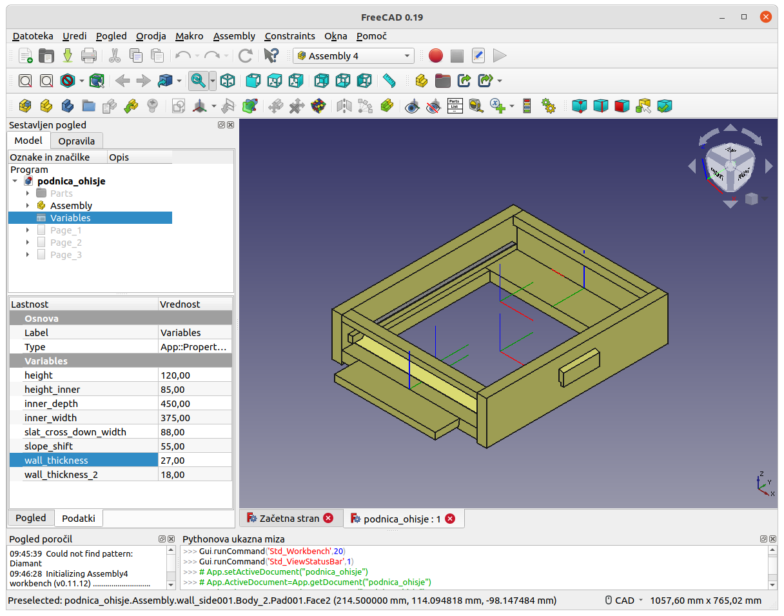
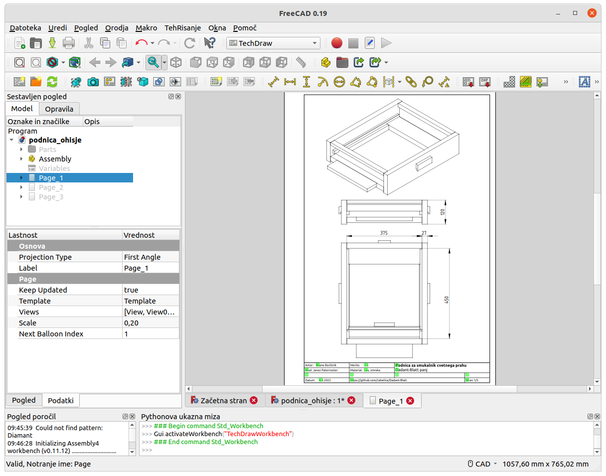

Uporaba programa FreeCAD
========================

FreeCAD je prost program za tehnično 3-D modeliranje. Ni tako izpopolnjen kot podobni komercialni programi je dovolj dober za ta projekt.

Namestitev
----------
1. Namesti https://www.freecad.org/ V času tega pisanja je bila nameščena zadnja verzija, to je 0.19.
2. po nameščenem FreeCADu, znotraj programa: meni "Orodja" -> "Upravljalnik dodatkov" -> namesti modul "Assembly4"

Primeri uporabe programa
------------------------
- V programu odpreš datoteko "podnica_ohisje.FCStd".
- Desno v oknu je viden 3-D model ali 2-D risba. Premika se s pritiskom na srednjo tipko miške in vlečenjem. Vrti se s pritiskom desne tipke miške in hkratinim držanje tipke "shift" na tipkovnici.
- Okno levo zgoraj vsebuje drevesno strukturo elementov v datoteki "podnica_ohisje.FCStd":
  - Mapa "Parts" vsebuje posamezne sestavne dele modela "podnica_ohisje.FCStd".
  - Mapa "Assembly" vsebuje zgradbo celotnega sestava. Z izbiro posameznega dela v tej mapi ga lahko s tipko "preslednica" preklopimo njegovo vidnost. Isto velja za sestavne dele v mapi "Parts".
  - Predmet "Variables" vsebuje spremenljivke za dimenzije, ki se uporabljajo pri tem modelu.
    - Ob kliku na "Variables" se v spodnjem oknu pojavi seznam spremenljivk.
    - Za primer spremeni vrednost "wall_thickness" s 27 na 25 in debeline lesenih plošč v modelu se spremenijo.
    - Sprememba se odraža tudi v kotah na risbah.
  - "Page_1", "Page_2", "Page_3" (dvojni klik) vsebujejo tehnične risbe.

Model je seveda možno tudi popolnoma spremeniti. Za več informacij o uporabi programa FreeCAD glej:
- https://wiki.freecad.org/Getting_started
- https://wiki.freecad.org/Assembly4_Workbench
  - [Tutorial 1 for a quick assembly from scratch](https://github.com/Zolko-123/FreeCAD_Examples/blob/master/Asm4_Tutorial1/README.md)
  - [Tutorial 2 for a cinematic assembly in one file, using a master sketch](https://github.com/Zolko-123/FreeCAD_Examples/blob/master/Asm4_Tutorial2/README.md)
- https://wiki.freecad.org/TechDraw_Workbench
  - https://wiki.freecad.org/Basic_TechDraw_Tutorial
