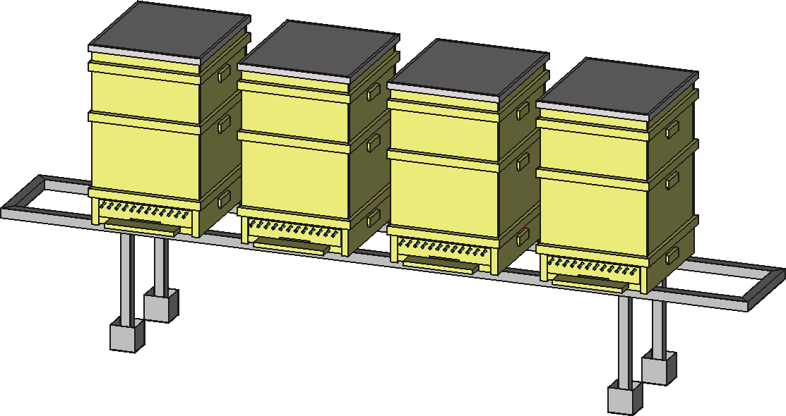

Dadant-Blatt panj
=================
Projekt vključuje detajlne risbe za izdelavo čebeljega nakladnega panja tipa Dadant-Blat.

Panj vključuje visoko podnico s smukalnikom cvetnega prahu oz. testno ploščo za varojo. Zasnova in dimenzije so plod raziskav slovenskih čebelarjev.

Vsebina projekta
----------------
Projekt vsebuje 3-D model in sestavne ter delavniške risbe potrebne za izdelavo panja. Panj je možno izdelati s hobi orodjem.

Material je po večini lepljen smrekov ali jelov les, ki se dobi v obliki skobljanih plošlč različnih širin in debelin. V projektu se večinoma uporabljajo plošče debeline 18 in 27 mm, kot na [tej povezavi](https://trgovina.slovenijales.si/lesni-materiali/lepljene-plosce/lepljene-plosce-smreka/lepljena-plosca-smrekajelka-27-mm-300-x-2500-mm-kvaliteta).

3-D modeli sestavnih delov panja in samega panja imajo končnico ``.FCStd`` in se odpirajo s programom FreeCAD, ki je prost za uporabo. V posameznem modelu je npr. možno enostavno spremeniti v spremenljivkah debelino stene okvirja (npr. s 27 na 25 mm) in vse risbe letvic se avtomatsko ustrezno popravijo. Kratka navodila za uporabo v programu FreeCAD so [tukaj](FreeCAD/README.md).

Vsebina projekta so tudi ``.pdf`` datoteke z risbami, ki se lahko natisnejo. Generirane so iz posamezih ``.FCStd`` datotek. Zraven je tudi nekaj slik ``.png`` in pa datoteka LICENSE, ki [omogoča prosto uporabo](https://sl.wikipedia.org/wiki/Licenca_Apache).

Uporaba projekta in sodelovanje
-------------------------------
Projekt je prosto dostopen na https://github.com/cebelice/Dadant-Blatt. Cel projekt se lahko prenese na svoj računalnik (gumb Code).

Komentarji, težave in predlogi ali razprava lahko poteka v zavihku "Issues" (potrebna je brezplačna registracija).

Bolj vešči uporabniki lahko naredijo "Fork" projekta na svoj račun na Githubu, ga dopolnjujejo po svoje in dopolnitve po želji pošljejo nazaj kot "Pull request". "git" je orodje za nadzor različic, ki hrani celo zgodovino projekta in običajno prikazuje samo datoteke iz najnovejše verzije. Precej ga uporabljajo programerji ampak primeren je tudi za projekt, kot je tale.

Visoka podnica in smukalnik cvetnega prahu
------------------------------------------
Avtor visoke podnice in smukalnika je Brane Borštnik in daje načrte v prosto uporabo.

Viskoka podnica se lahko uporablja na dva načina:

### S smukalnikom cvetnega prahu
V podnico se od zadaj vstavi "smukalnik" in "smukalnik_mreza". Z mreže se dnevno odstranjuje cvetni prah in se ga takoj zamrzne.

### Z mrežo in testno ploščo
Namesto smukalnika se vstavi "podnica_mreza" in pod njo "testna_plosca" za varojo, ki se jo na tanko namaže z litijevo mastjo. Priporoča se izdelavo testne plošče iz materiala [Forex](http://www.sign-supply.si/forex-plosce-unipan/forex-plosce.html), 3mm.
